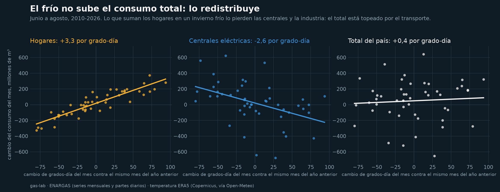
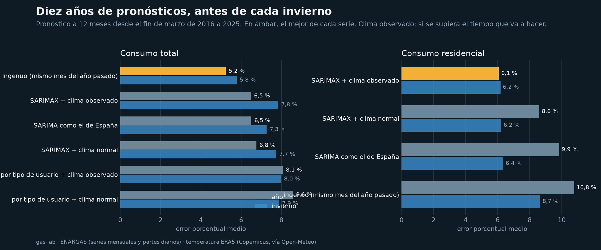
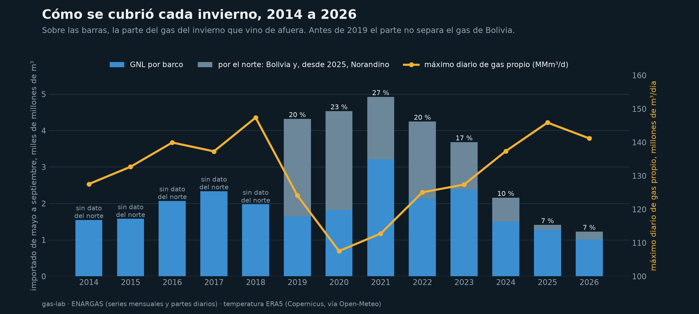
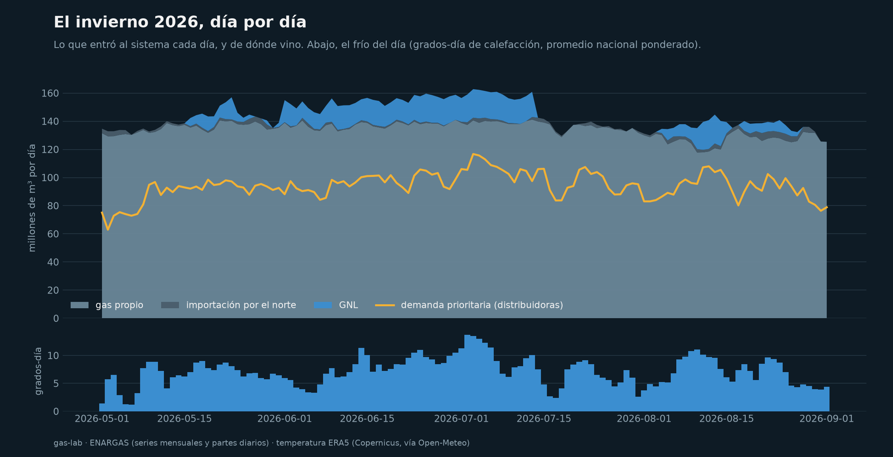
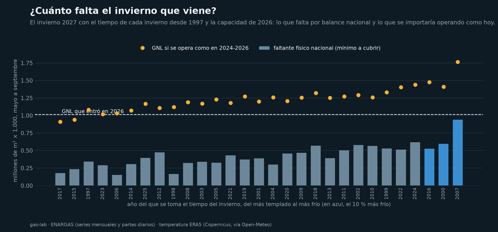

# gas-lab

¿Cuánto gas va a pedir la Argentina el invierno que viene, y alcanza en el día más frío? Con 30
años de consumo mensual del ENARGAS, más de 4.600 partes diarios desde 2014 y la temperatura
diaria de diez ciudades. Undécimo repo de la serie Sur Analytics.

> El frío no sube el consumo total de gas: lo redistribuye. En un invierno más frío los hogares
> consumen más y las centrales y la industria, casi lo mismo menos. El total de invierno no mide
> la demanda: mide lo que el sistema puede entregar. Y el GNL que se importa no depende de cuánto
> frío hace: se compra antes.



## De dónde sale

Un trabajo reciente pronosticó la demanda de gas de España con un SARIMA sobre 22 años de datos,
con un error del 5 % en el último año y sin temperatura. Este repo hace la misma pregunta para la
Argentina y le suma dos cosas: la temperatura diaria y los partes diarios del ENARGAS, que dicen
cuánto gas entró al sistema cada día y de dónde vino.

## Qué hace

| Notebook | Qué hace |
|---|---|
| `01_la_demanda_y_el_frio` | Consumo mensual 1996-2026 por tipo de usuario, las dos estacionalidades opuestas (hogares en invierno, centrales en verano), la redistribución del frío, diez años de pronósticos antes de cada invierno con cinco modelos, y el invierno 2027 con el tiempo de cada invierno desde 1997. |
| `02_alcanza_el_gas` | Los partes diarios 2014-2026: cómo se cubrió cada invierno (gas propio, GNL por barco, importación por el norte), el invierno 2026 día por día, la demanda prioritaria contra el frío del día, y cuánto faltaría el invierno 2027 con el tiempo de cada invierno desde 1997. |

Las funciones están en `src/glab/`: `series.py` trae las series del ENARGAS por la API del
Estado; `clima.py` la temperatura ERA5 y los grados-día; `partes.py` baja y lee los partes
diarios (un PDF por día); `modelos.py` tiene el ingenuo, el SARIMA como el de España, el SARIMAX
con temperatura y el modelo por tipo de usuario; `validacion.py` los pronósticos desde cada año;
`escenarios.py` el abanico de inviernos; `pico.py` el balance diario; `figuras.py` dibuja. Tests
con datos sintéticos; los notebooks narran.

## Qué encontramos

**Dos estacionalidades opuestas.** Los hogares consumen 55 millones de m³ por día en julio y 10
en enero. Las centrales eléctricas tienen el pico en verano, 48 en enero, por el aire
acondicionado.

**El frío no sube el total: lo redistribuye.** Comparando cada mes de junio a agosto con el mismo
mes del año anterior desde 2010: cada grado-día de calefacción adicional suma 3,3 millones de m³
al mes en los hogares (correlación 0,90) y resta 2,6 en las centrales y 0,2 en la industria. El
total se mueve 0,4, con una correlación de 0,07. Cuando hace frío se prioriza a los hogares y se
corta a los demás: el total de invierno está topeado por el transporte.

**En el total, gana el más simple.** Diez pronósticos a 12 meses, uno desde el fin de marzo de
cada año entre 2016 y 2025:

| Modelo | Total: error medio | Hogares: error medio |
|---|---|---|
| Ingenuo: el mismo mes del año anterior | **5,2 %** | 10,8 % |
| SARIMA como el de España | 6,5 % | 9,9 % |
| SARIMAX con temperatura (clima normal) | 6,8 % | 8,6 % |
| SARIMAX con temperatura (clima observado) | 6,5 % | **6,1 %** |

El ingenuo iguala al SARIMA de España en el total, y la temperatura no lo mejora: el total no
responde al frío. En los hogares la temperatura sí manda, y el error baja a la mitad si se sabe
qué tiempo va a hacer.



**El invierno 2027 de los hogares.** Con el tiempo de cada invierno entre 1997 y 2025, el consumo
residencial de junio a agosto de 2027 va de 49,5 millones de m³ por día en un invierno cálido a
57,7 en uno frío, con 53,6 en uno normal.

**Cómo se cubrió cada invierno.** Con los partes diarios, de mayo a septiembre:

| Invierno | GNL por barco (millones de m³) | Por el norte | Parte importada | Máximo diario de gas propio (MMm³/d) |
|---|---|---|---|---|
| 2019 | 1.648 | 2.674 | 20 % | 124 |
| 2021 | 3.211 | 1.715 | 27 % | 113 |
| 2023 | 2.389 | 1.294 | 17 % | 127 |
| 2025 | 1.281 | 129 | 7 % | 146 |
| 2026 (a 1/9) | 1.017 | 209 | 7 % | 141 |

Bolivia se fue en 2024; lo que figura por el norte en 2025 y 2026 es el gasoducto Norandino, que
trae gas desde Chile. El gas propio máximo creció con el gasoducto Perito Moreno, y la parte
importada bajó de 27 % a 7 %. El GNL bajó, pero no desapareció, y no sigue al frío: entre 2021 y
2026 la correlación entre el GNL de cada invierno y sus grados-día es de -0,19.



**El día más frío de 2026.** El 3 de julio las distribuidoras entregaron 117 millones de m³, la
inyección total llegó a 163, el gas propio a 141 y el GNL a 20. Ese techo de gas propio, 141
millones de m³ por día, no se superó en todo el invierno.



**¿Cuánto falta el invierno que viene?** El modelo del día pone la demanda prioritaria en función
del frío con inercia (las casas tardan en enfriarse: con el frío del día solo explica la mitad
de la variación; con los días previos, el 76 %), suma la demanda directa sin cortes y la
diferencia entre inyección y consumo, y la compara con el techo de gas propio de 2026. Con el
tiempo de cada invierno desde 1997:

| Invierno 2027 con el clima de... | Días con faltante | Faltante físico (millones de m³) | GNL operando como 2024-2026 |
|---|---|---|---|
| un invierno cálido (p10) | 44 | 222 | 1.031 |
| uno normal (mediana) | 57 | 395 | 1.231 |
| uno frío (p90) | 72 | 584 | 1.417 |

El faltante físico nacional es el mínimo a cubrir; en 2026 fue un tercio del GNL que entró
(371 contra 1.017 millones de m³, con el calendario bien marcado: correlación diaria 0,64). La
diferencia tiene dos explicaciones. El GNL entra por Escobar, al lado del AMBA, y reemplaza gas
propio que no llega por los troncales aunque el total alcance: el cuello es regional. Y los
buques se contratan antes del invierno. Por eso la segunda columna, que mide cuánto GNL se usó en
cada nivel de frío entre 2024 y 2026, es la que más se parece a lo que va a pasar.



## Limitaciones

- **La temperatura** es la del reanálisis ERA5 en una ciudad por área de distribución, ponderada
  por el consumo total de cada distribuidora. En las áreas grandes, una ciudad es una
  aproximación.
- **Los partes diarios** son datos provisorios de las licenciatarias. Faltan 68 de más de 9.000,
  la mayoría de 2021. Antes de 2019 no separan el gas de Bolivia de la producción del norte; desde
  2019 algunos días no imprimen la nota y se interpola entre días vecinos.
- **La demanda directa en los días de corte** ya está recortada. Se estima su nivel sin cortes con
  los días templados del mismo invierno.
- **El balance es nacional** y no ve los cuellos regionales, que es donde el GNL de Escobar hace
  diferencia.
- **Todo supone la capacidad de 2026.** Una ampliación del transporte cambia el techo y la
  cuenta; los notebooks se vuelven a correr.
- **Sin precios.** Los aumentos de tarifa de 2016 a 2019 cambiaron el consumo por grado-día; los
  modelos los absorben con retraso.
- **Un buque, 85 millones de m³**, es un promedio (140.000 m³ de GNL a razón de 600 m³ de gas por
  m³ de GNL); los barcos de Escobar varían.

## Cómo correrlo

```
python -m venv .venv
.venv\Scripts\python.exe -m pip install -r requirements.txt
.venv\Scripts\python.exe -m ipykernel install --user --name gas-lab --display-name "gas-lab"
.venv\Scripts\python.exe scripts/download_data.py
.venv\Scripts\python.exe scripts/download_partes.py 2014-01-01 --invierno
.venv\Scripts\python.exe -m pytest -q tests
.venv\Scripts\python.exe -m jupyter nbconvert --to notebook --execute --inplace notebooks/01_la_demanda_y_el_frio.ipynb
.venv\Scripts\python.exe -m jupyter nbconvert --to notebook --execute --inplace notebooks/02_alcanza_el_gas.ipynb
```

La descarga de los partes pide al servidor del ENARGAS con seis pedidos a la vez; los inviernos
tardan una hora y el año completo, dos. La primera lectura de los PDF tarda unos 25 minutos y
queda guardada. En Linux, en lugar de `.venv\Scripts\python.exe`, `.venv/bin/python`.

## Datos y licencias

- ENARGAS, "Producción y consumo de gas natural", por la API de series de tiempo de
  datos.gob.ar: <https://datos.gob.ar/series>
- ENARGAS, partes diarios operativos (gas distribuido y gas transportado):
  <https://www.enargas.gob.ar/secciones/transporte-y-distribucion/dod-partes-dist-trans.php>
- ERA5, Copernicus Climate Change Service (ECMWF), vía el archivo histórico de Open-Meteo
  (CC BY 4.0): <https://open-meteo.com/en/docs/historical-weather-api>
- El trabajo sobre España que inspiró la comparación: Diego Agudo,
  <https://github.com/diegoagudoa-eng/gas-demand-forecasting-sarima>

Código con licencia MIT.

## Autor

Diego Piñero, Sur Analytics.
